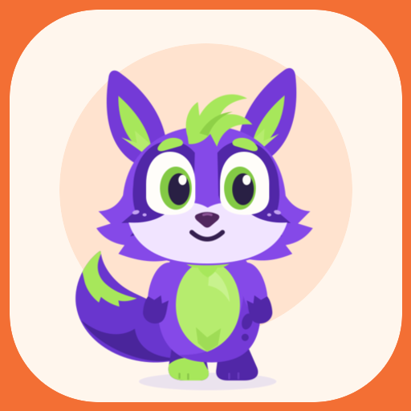
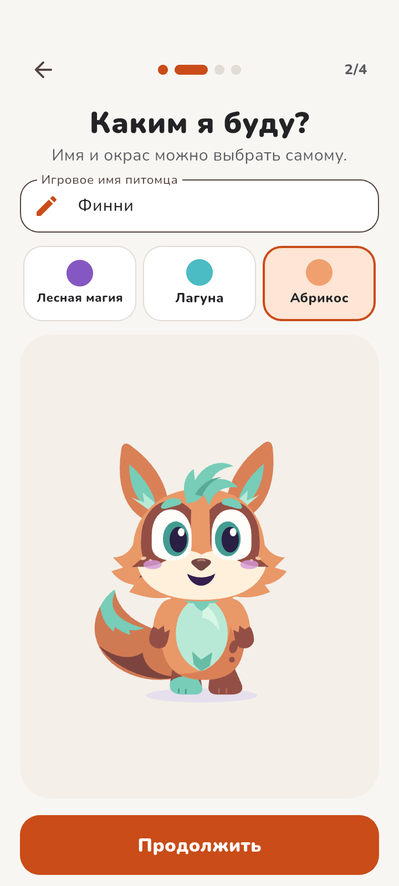
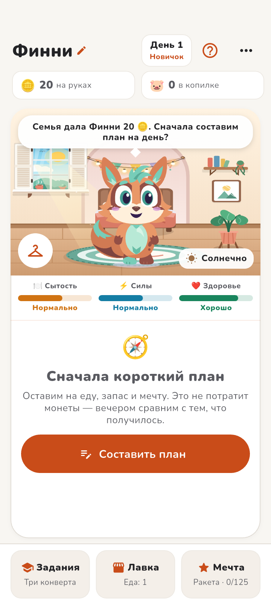
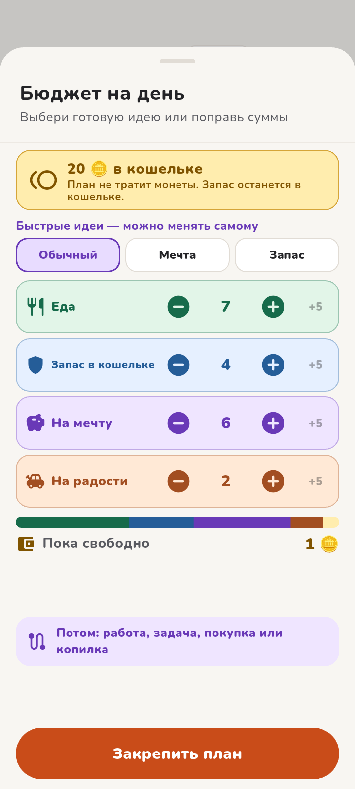
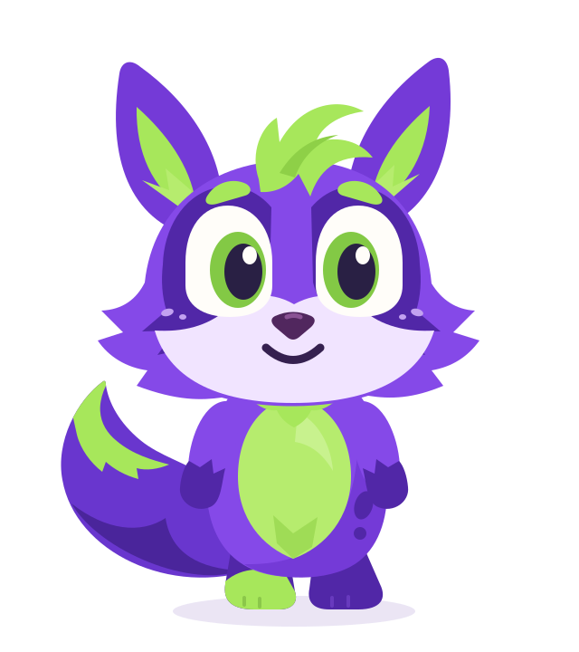

<p align="center">
  
</p>

<h1 align="center">🦊 Питомец Финни</h1>

<p align="center">
  <strong>Игровой мобильный сервис по финансовой грамотности для детей 7–11 лет</strong><br>
  Конкурсное решение для хакатона <strong>«Лидеры цифровой трансформации 2026»</strong> (Депфин Москвы)
</p>

<p align="center">
  <a href="https://github.com/TABURELTER/Finny-android-app"></a>
  
  
  
  
  
</p>

---

## ⚡ Экспресс-проверка для жюри

| Файл / Раздел | Назначение | Ссылка |
|---|---|---|
| 📦 **Готовый APK** | Релизная подписанная сборка (v1.0.0, 58.7 МБ, без IDE) | [📥 finny-pet-release.apk](finny-pet-release.apk) |
| 🎮 **Демо-панель** | Экспресс-тест дней 1–10, сброс и **накрутка монет** | Меню `⋯` ➔ `Демо` |
| 📱 **Скриншоты** | 3 ключевых экрана с физического устройства 360 dp | [docs/screenshots/](docs/screenshots/) |
| 📋 **Матрица ТЗ** | Аудит выполнения всех пунктов ТЗ и Приложения А | [docs/TZ_COMPLIANCE_2026-09-29.md](docs/TZ_COMPLIANCE_2026-09-29.md) |
| 🏷️ **Карточка RuStore** | Черновик публикации: категория «Детские», 0+, описание | [docs/RUSTORE_CARD_DRAFT.md](docs/RUSTORE_CARD_DRAFT.md) |

---

## 📸 Галерея интерфейса

<table align="center">
  <tr>
    <td align="center" width="33%">
      <br>
      <b>1. Создание питомца</b><br>
      <sub>Окрасы, гардероб и Color Picker</sub>
    </td>
    <td align="center" width="33%">
      <br>
      <b>2. 3-слойная комната</b><br>
      <sub>Окно с погодой, живой Финни, AI-вещи</sub>
    </td>
    <td align="center" width="33%">
      <br>
      <b>3. План на день</b><br>
      <sub>4 конверта и защита от импульсивных трат</sub>
    </td>
  </tr>
</table>

---

## 🎨 Полная кастомизация Финни



Ребёнок может настроить Финни **как душе угодно** — от внешности до деталей гардероба:
- 🦊 **3 базовых окраса:** классический фиолетовый, солнечный абрикос и мятная лагуна.
- 🎨 **Кастомный цвет куртки (Color Picker):** выбор любого оттенка через встроенную палитру приложения.
- 🧥 **Гардероб и аксессуары:** надевание головных уборов и непромокаемого дождевика в сырую погоду.
- 🐾 **Живые реакции:** питомец моргает, потягивается, мурлычет, прыгает и машет лапкой при тапах.
- 📈 **3 стадии взросления:** *«Новичок»* ➔ *«Планировщик»* ➔ *«Самостоятельный»* (персонаж растёт по мере разумных решений).

<br clear="right" />

---

## 💡 Ключевые принципы и механики

### 1. «Сначала планируй — потом трать» (ТЗ п. 2.5.5)
- **Умная авто-маршрутизация:** если план на день ещё не закреплён, нажатие на «Лавку», «Задания» или «Мечту» мягко открывает шторку распределения бюджета (конверты *Еда, Запас, Мечта, Радости*).
- **Бесшовный переход:** после нажатия кнопки «Закрепить план» приложение сразу открывает нужный экран без повторного клика.

### 2. Безопасная ошибка и итоги дня
- Финни не может погибнуть или сбежать. Если денег не хватило — игра объясняет причину и предлагает заработать монеты на мини-работе (*«Ценники»*, *«Заказ»*).
- Вечером наглядный экран сравнивает план с фактом.

### 3. Инновационная 3-слойная комната
- **Слой 1:** вид из окна меняется по прогнозу погоды (солнце, дождь, гроза, облака).
- **Слой 2:** постоянный векторный интерьер комнаты с прозрачным окном.
- **Слой 3:** купленные AI-предметы (лежанка, лампа, мяч, робот, змей) с прозрачным фоном и тапами.

### 4. Умный звук и музыка
- Ненавязчивый эмбиент-саундтрек и 5 звуковых эффектов.
- **Корректный жизненный цикл:** музыка мгновенно затихает при сворачивании (Home / блокировка) и возобновляется при возврате.

---

## 🛠️ Демо-режим с накруткой монет (для жюри)

В меню **`⋯` ➔ `Демо`** экспертам доступны инструменты быстрой проверки:
- **Переход к любому дню (1–10):** мгновенная проверка ключевых событий (ливень, крыша, ярмарка).
- 🪙 **Управление балансом (накрутка):** кнопки `+20 🪙`, `+50 🪙`, `+100 🪙` и `Обнулить` для тестирования покупок дорогостоящих предметов и проверки защиты от нехватки средств.
- **Безопасная изоляция:** демо-профиль хранится отдельно, основной прогресс не сбрасывается.

---

## 📊 Экстремальная оптимизация (Samsung Galaxy S22 Ultra)

| Метрика | До отладки | После отладки | Результат |
|---|:---:|:---:|---|
| **Нагрузка CPU в покое** | `106%` | **`0.0% – 1.0%`** | 🟢 Телефон холодный |
| **Температура процессора** | `42.2°C` | **`32.7°C`** | 🟢 Снижение нагрева на 10°C |
| **FPS экрана в покое** | `120.0 FPS` | **`0.0 FPS`** | 🟢 Статичный буфер, экономия АКБ |
| **Сетевые запросы** | `0` | **`0` (100% Офлайн)** | 🟢 Безопасность детей и данных |

---

## 🚀 Сборка из исходников

```bash
git clone https://github.com/TABURELTER/Finny-android-app.git
cd Finny-android-app
flutter pub get
flutter analyze           # 0 ошибок, 0 предупреждений
flutter build apk --release
```
Файл сборки: `build/app/outputs/flutter-apk/app-release.apk` (и копия в корне `finny-pet-release.apk`).

---

## 📚 Конкурсная документация ([docs/](docs/))

* [📋 Матрица соответствия ТЗ (построчный аудит)](docs/TZ_COMPLIANCE_2026-09-29.md)
* [🏗️ Архитектурная записка](docs/ARCHITECTURE_2026-09-29.md)
* [🎓 Карта образовательного контента](docs/EDUCATIONAL_CONTENT.md)
* [📱 Отчёт о тестировании на S22 Ultra](docs/DEVICE_CHECK_2026-09-29.md)
* [🏷️ Черновик карточки RuStore](docs/RUSTORE_CARD_DRAFT.md)
* [🧪 Матрица ручной приёмки (M01–M15)](docs/MANUAL_ACCEPTANCE_2026-09-29.md)
* [⚖️ Лицензии и авторские права](docs/ASSETS_AND_LICENSES.md)

---
<p align="center">Разработано для финала «Лидеры цифровой трансформации 2026» 💚</p>
